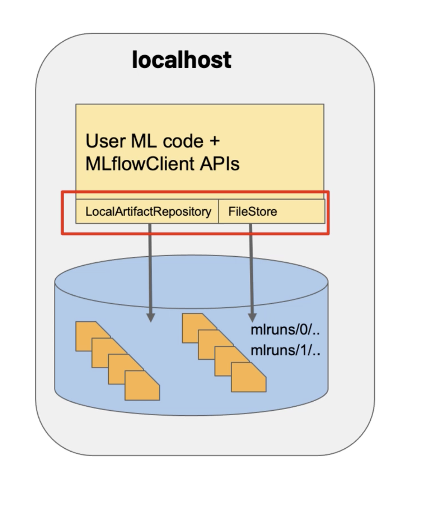
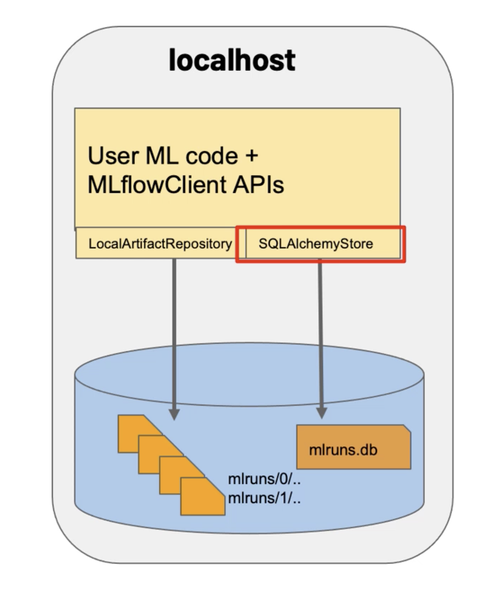
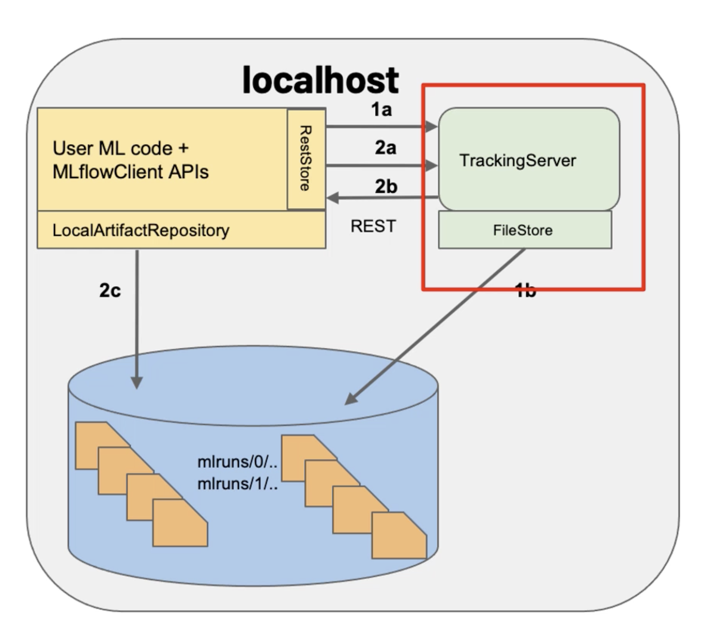
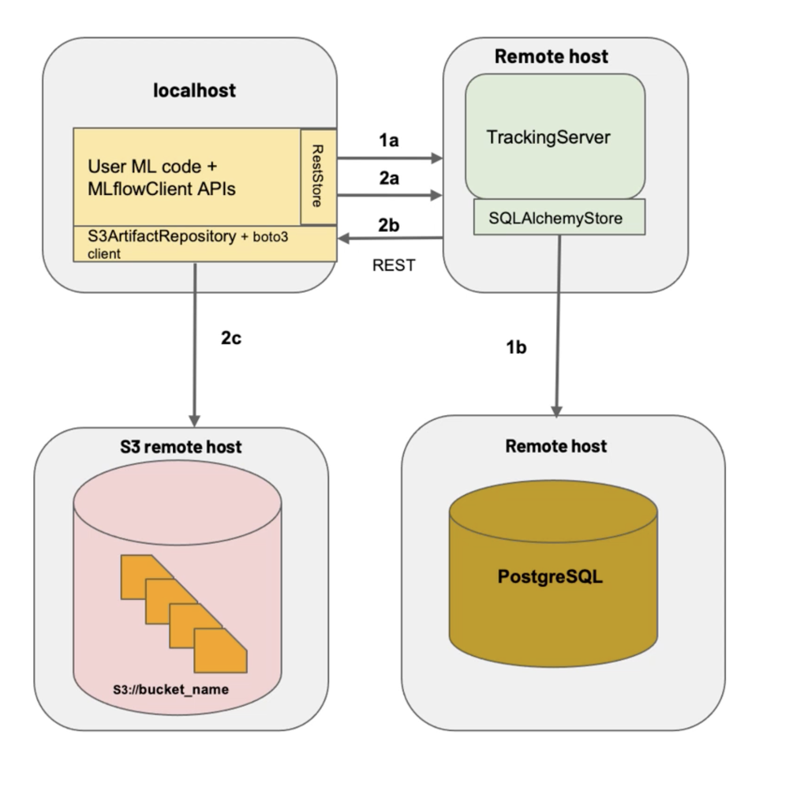

### Run it locally

1. Clone the repository
2. Run the following commands:

```bash
poetry install
poetry run python -m main --alpha=0.1 --l1_ratio=0.7
poetry run mlflow ui // In another terminal
```

or

```bash
poetry install
poetry shell
python -m main --alpha=0.1 --l1_ratio=0.7
mlflow ui // In another terminal
```

## MLFlow configurations
Localhost 
Localhost with db for parameters 
Localhost Tracking Server 
Remote host 
Proxy server 
Proxy server just for arctifacts 